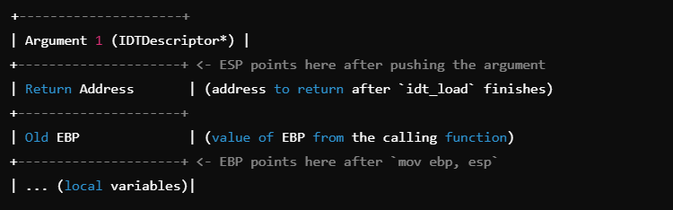

### Function Compilation in C

## Stack Frame
Stack Frame is created on top of the function that called the new function

- The caller pushes the arguments to the function onto the stack, from right to left.
- The caller pushes the return address onto the stack.
- The callee (the called function) typically sets up a new stack frame by pushing the old EBP

caller->`void __attribute__((cdecl)) idt_load(IDTDescriptor* idt)`

```
(callee block)
idt_load:

    push ebp             ; save old call frame
    mov ebp, esp         ; initialize new call frame
    
    mov eax, [ebp + 8]   ; access first arg
    lidt [eax]
```

https://www.youtube.com/watch?v=7ukTs4Bi7hI&list=PLHMcG0zmCZcj7hKyHgQGGEZ41UWKaISKU&index=6

